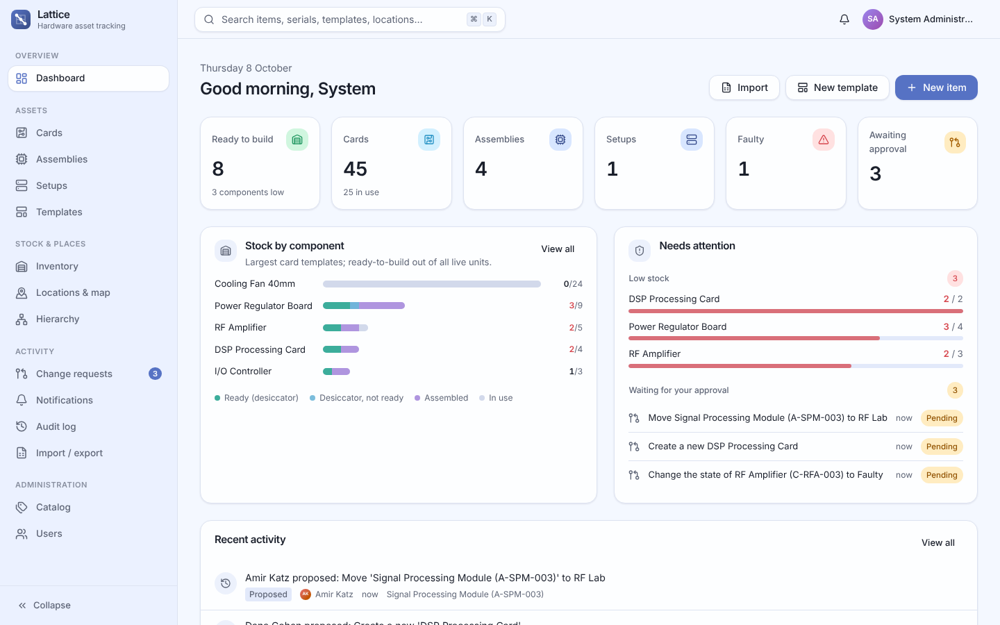
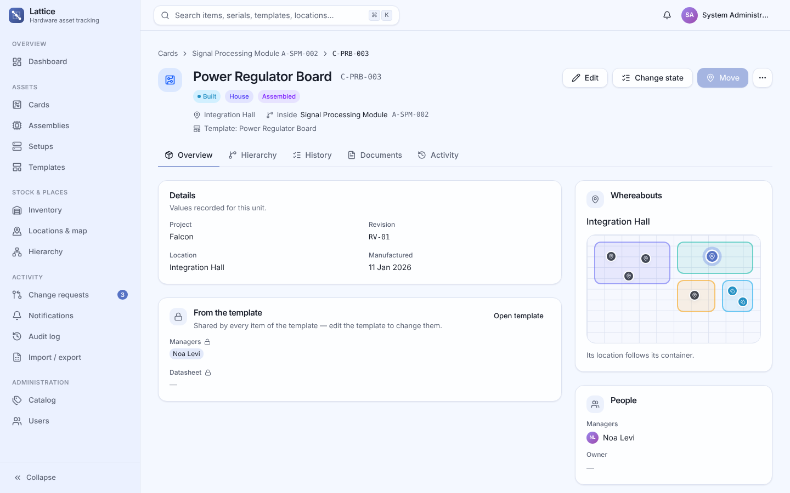
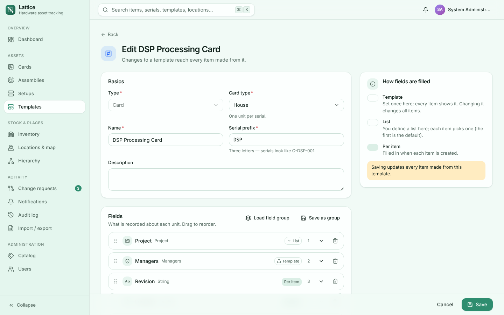
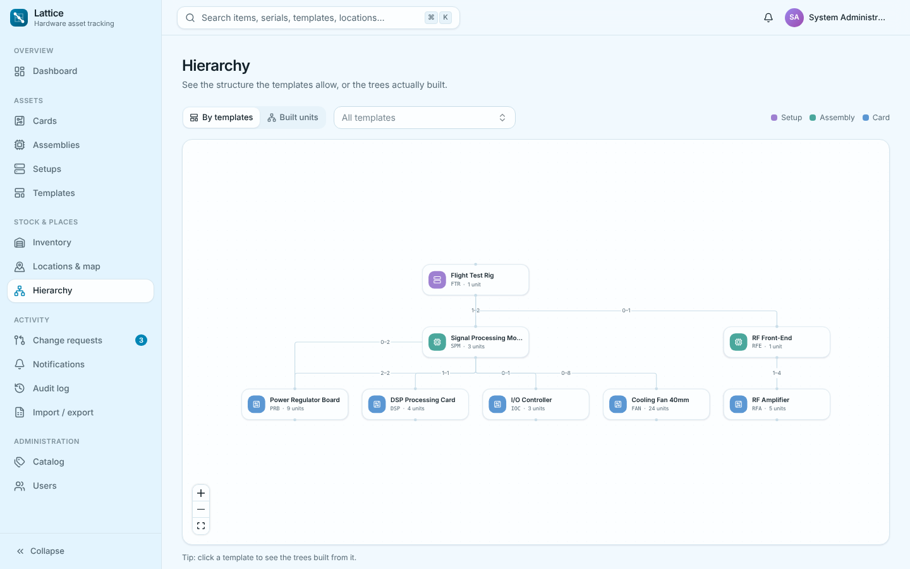
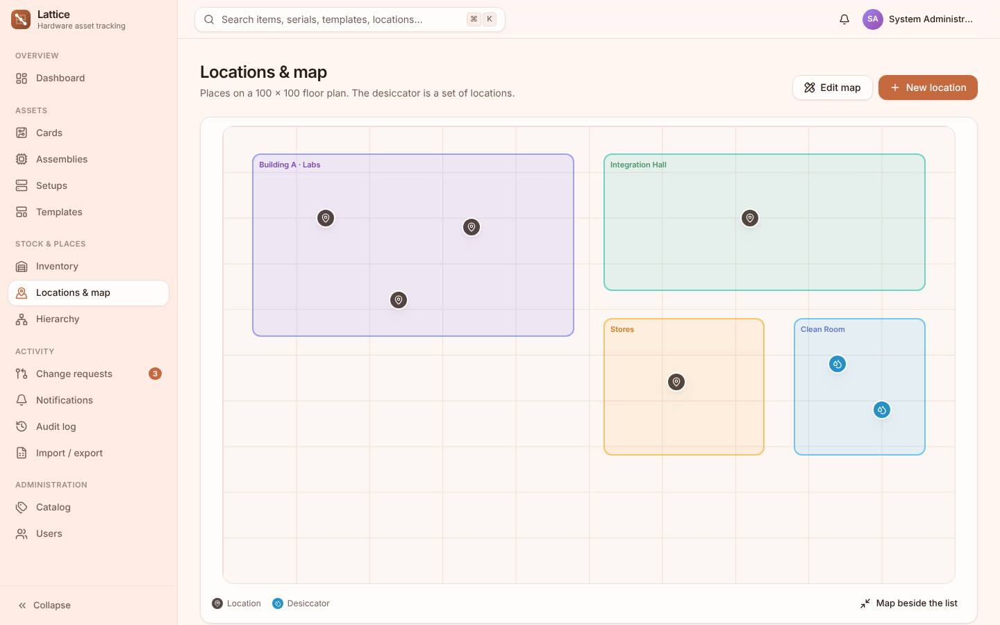
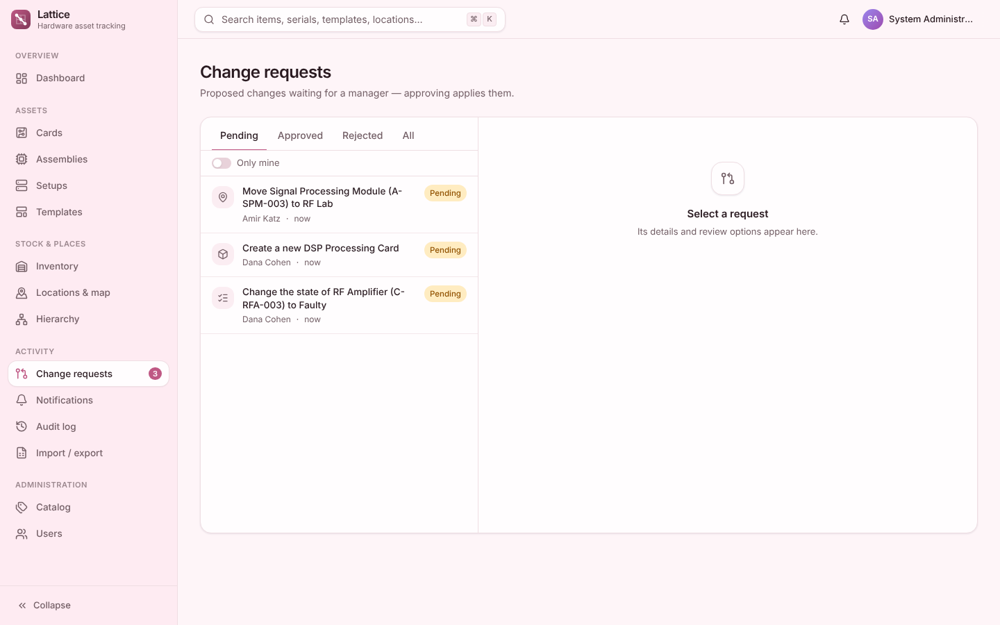
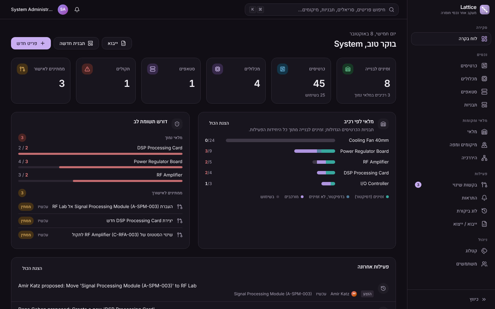
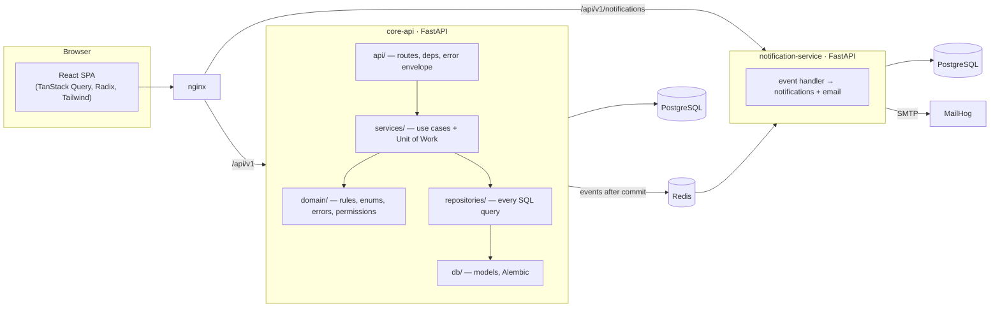

# Lattice

**Hierarchical hardware asset tracking** — setups (סטאפים) hold assemblies (מכלולים), assemblies hold cards (כרטיסים), and every item is made from a template.

Lattice knows, at any moment, which card sits inside which assembly inside which setup; where every loose card physically is; how much stock is ready to build in the desiccator; and who changed what, when. Moving a container drags everything inside it, every change is audited, and editors' changes go through a manager's approval.

This is the second generation of Lattice: the same product, rebuilt with a **layered backend** (domain → repositories → use cases → thin HTTP), a **cleaner `/api/v1`**, and a new **React** interface.



| | |
|---|---|
|  |  |
|  |  |
|  |  |

---

## Quick start

```bash
cp .env.example .env          # optional: secrets, admin account, ports
docker compose up --build     # or: make up
```

| URL | What |
|---|---|
| http://localhost:8080 | **The app** (nginx serves it and proxies `/api` to both services) |
| http://localhost:8000/docs | Core API — interactive OpenAPI |
| http://localhost:8001/docs | Notification service — interactive OpenAPI |
| http://localhost:8025 | MailHog — the emails Lattice sends |

Sign in as **`admin@lattice.io` / `admin1234`** (the only account a fresh system has — change the password). Lattice ships **empty**; the dashboard's *Set up your workspace* checklist walks through the order to fill it in.

Want something to click around in? With the stack running and still empty:

```bash
make demo        # uv run python scripts/seed_demo.py
```

builds a small realistic world — people, catalog, a floor plan, templates, ~50 items, thresholds and a few pending proposals — entirely through the public API. Demo accounts (`noa`/`dana`/`amir`/`yael@lattice.io`, password `demo1234`) appear as one-click shortcuts on the sign-in screen.

### Local development (no Docker)

```bash
make sync          # uv sync --all-packages && npm install
make dev-core      # core API on :8000 (SQLite by default)
make dev-notify    # notification service on :8001
make dev-web       # web app on :5173, proxying /api to both
```

Redis is optional locally (`REDIS_URL=` disables the event bus); without an SMTP host, emails are logged instead of sent.

### Checks

```bash
make check         # ruff + backend tests + web typecheck, translation check and build
LATTICE_TEST_POSTGRES_URL=postgresql+psycopg://user@localhost:5432/postgres make test-pg
```

The core API's suite (74 tests) runs on SQLite by default and on PostgreSQL when pointed at a server — each test gets a fresh database cloned from a template. A test also fails if a model change has no migration. CI (`.github/workflows/ci.yml`) runs all of it.

---

## What's in the box

- **Templates** — every item is made from one. A template owns the name, card type, serial prefix (`C/A/S-XXX-###`) and **fields** in three modes: *Template* (one shared value — editing it updates every item), *List* (each item picks; first is the default) and *Per item*. 21 field types, from formatted strings (`XX-#####`) to catalog values, managers, files and the physical facts (location, container, status, quantity). Reusable **field groups**; **duplicate** a template including its shared files.
- **Hierarchy** — containers list which templates may sit inside them with **min/max counts**; links are validated, incomplete items are flagged, moves cascade downward, and a linked item has no location of its own. Graphs of the template structure, of every tree built from a template, and of one item in context.
- **Stock** — per card template: ready to build (built/OK in the desiccator), in the desiccator, in use, assembled, faulty. The **desiccator is a set of locations**. **Thresholds** alert the managers of those cards (one digest each) — only for the templates a change actually affected.
- **Workflow** — managers change things directly; editors **propose** any change and viewers may propose a move. The same dialogs do both. Approving runs the exact use case a manager would.
- **Everything else** — floor-plan map with drawable buildings, documents (real uploads), Excel import (all-or-nothing, every bad cell listed) and export, audit log with "my items" and Excel export, in-app + email notifications, global ⌘K search, English and Hebrew (RTL), light/dark and seven pastel colour themes.

---

## Architecture



The design — layers, the Unit of Work, permissions, events, the error envelope and the frontend's structure — is described in **[docs/ARCHITECTURE.md](docs/ARCHITECTURE.md)**. The HTTP contract is in **[docs/API.md](docs/API.md)** (and live at `/docs`). **[docs/USER_GUIDE.md](docs/USER_GUIDE.md)** (Hebrew) explains how to use the system.

### What changed from the first version

| | Before | Now |
|---|---|---|
| Layers | Routers held queries, commits and side effects; services took `dict`s | `api → services → repositories → db`, with a pure `domain` package. Routes never touch SQL; services take typed commands |
| Transactions | Each route committed (or forgot to roll back) | One re-entrant **Unit of Work** per request; an approval that runs several use cases is still one transaction |
| Side effects | Events published inline; files deleted before commit | Events, file deletions and stock checks run **after commit**; files written by a failed transaction are removed |
| Permissions | `require_manager` / role comparisons spread around | Named **permissions** per role, checked in the use cases; `GET /auth/me` returns them so the UI shows exactly what's allowed |
| Errors | `{detail}` strings, a mix of 400/409/422 shapes | One envelope: `{error: {code, message, issues[]}}`; `issues` pin problems to a field or spreadsheet cell |
| API | Mixed shapes, no paging | `/api/v1`, `Page{items,total,limit,offset}` lists, idempotent `PUT` for thresholds/links, typed proposal payloads validated **at submission** |
| Low-stock alerts | Re-checked every threshold after any card change | Only the card templates a transaction touched |
| Frontend | Vue + Vuetify, hand-written API types | React + Tailwind + Radix; API types **generated from OpenAPI**; one dialog for "apply" and "propose"; ⌘K palette; localized change descriptions |

### Layout

```
lattice/
├── services/
│   ├── core-api/src/lattice_core/
│   │   ├── domain/          enums, rules (fields, serials, hierarchy), errors, permissions
│   │   ├── db/              models (one module per aggregate), session, migrations
│   │   ├── repositories/    data access — every query lives here
│   │   ├── services/        use cases, Unit of Work, audit trail
│   │   ├── views/           presenters: rows → view models
│   │   ├── schemas/         commands & views (the API contract)
│   │   ├── infra/           security, file storage, event publisher
│   │   └── api/             routes, dependencies, error handlers
│   └── notification-service/
├── packages/lattice-shared/ the event contract
├── frontend/src/
│   ├── api/                 client, generated types, endpoints, query hooks
│   ├── components/ui/       design-system primitives
│   ├── components/domain/   field inputs, pickers, graph, floor plan, badges
│   ├── features/<area>/     one folder per area of the app
│   └── i18n/                English & Hebrew
├── scripts/seed_demo.py     demo world, through the API
└── docs/
```

---

## Configuration

| Variable | Service | Default |
|---|---|---|
| `DATABASE_URL` | core | `sqlite:///./lattice_core.sqlite3` |
| `NOTIFY_DATABASE_URL` | notifications | `sqlite:///./lattice_notify.sqlite3` |
| `REDIS_URL` | both | `redis://localhost:6379/0` (empty disables the bus) |
| `JWT_SECRET` | both | dev value — **set it** (both services must share it) |
| `BOOTSTRAP_ADMIN_EMAIL` / `_PASSWORD` | core | `admin@lattice.io` / `admin1234` |
| `UPLOAD_DIR`, `MAX_UPLOAD_MB`, `STAGED_UPLOAD_TTL_DAYS` | core | `./uploads`, `50`, `14` |
| `SMTP_HOST`, `SMTP_PORT`, `SMTP_FROM`, `SMTP_USE_TLS` | notifications | `localhost`, `1025`, … (empty host = log only) |

The schema is owned by Alembic and upgraded on start-up (`make migration m="…"` after changing a model).
